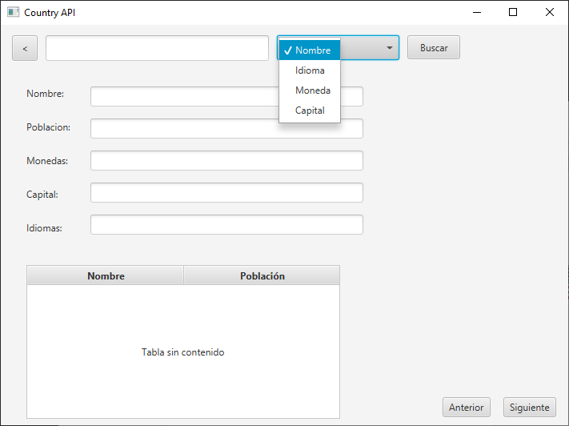

# PROXECTO ACCESO A DATOS UD1  

## Participantes  

- Sergio Alonso Pazo  
- Mario González Besada  

## Información de la API

Para este programa usamos la API [restcountries.com](https://restcountries.com) v2 y en concreto los siguientes endpoints:  

- **all**: para cuando se quiere guardar la API en cache y así usarla en modo offline  
- **name**: para buscar un país por su nombre  
- **currency**: para buscar países por las monedas que utilizan  
- **capital**: buscando países por su capital  
- **language**: buscando países por los idiomas utilizados en estos  

## Manual técnico  

El código fuente Java de este proyecto está estructurado en un paquete principal (*countryapi*) y un segundo nivel de paquetes (*dao*, *model*, *controller*).  

### ***countryapi***  

Contiene las clases *Main* y *Launcher* para lanzar la aplicación. La función de launcher es iniciar el método *Main.main()* para que sea posible empaquetar el proyecto en un archivo jar.  

***Main*** es la clase que inicia la aplicación y contiene el atributo *screenMap* en el que se almacenan cargadas las distintas vistas con las que cuenta la aplicación junto con un nombre que se usa para acceder a ellas y establecerlas como vista activa según requiera el usuario con el método *activate()*.

### ***model***  

Contiene un único paquete, *country*, en el cual se encuentran los *Plain Old Java Objects* generados mediante el plugin RoboPOJOGenerator de IntelliJ Idea.  

La clase principal del modelo es *Country*, la cual es una clase que únicamente contiene atributos (nombre, continente, población, etc.) y métodos accesores.  

### ***dao***  

Está compuesto por las clases *Data* y *CountryFetcher*.  

- ***Data***: singleton utilizado para gestionar el inicio de sesión.  
  - *loadCredentials()*: carga del fichero *properties.txt* que el usuario debe introducir para iniciar sesión.  
- ***CountryFetcher***: contiene métodos estáticos para comprobar la conexión a internet (*checkConnection()*), descargar datos de la API para guardarlos en caché (*fetch()*) y obtener de los archivos guardados objetos *Country* y imágenes de banderas para su uso en los juegos.  

### ***controller***  

Paquete para los controladores de las vistas de la aplicación. Contiene las clases:  

- ***MainController***: controlador para la vista de inicio de sesión.  
  - *onLoginClick()*: realiza la comprobación de los datos introducidos por el usuario y muestra una advertencia en caso de que sean incorrectos.  
  - *onDescargarButtonClick()*: llama a *CountryFetcher.fetch()* para actualizar los datos en caché.  
- ***MenuController***: proporciona acceso al resto de vistas llamando a *activate()* con el argumento adecuado en función del botón pulsado.  
- ***SearchController***: da funcionalidad a la pantalla de búsqueda.
  - *onBuscarClick*: obtiene datos de la API según el texto introducido por el usuario usando métodos de *CountryFetcher* y los introduce en la tabla de resultados.  
  - *showCountry()*: actualiza los campos de la interfaz gráfica.
  - *onSiguienteButtonClick()* y *onAnteriorButtonClick()*: permiten al usuario navegar por la lista de resultados llamando a *showCountry()* y teniendo en cuenta la posición del resultado actual con el atributo *viewIndex*.  
- ***FlagGameController***: da funcionalidad al juego de adivinar banderas.  
  - *setCurrentCountries()*: actualiza la vista seleccionando tres países para los campos de texto y determinando el correcto para mostrar su bandera.  
  - *checkAnswer()* y *updateScore()*: la lógica del juego. Check answer llama a *updateScore()* con cada respuesta correcta. También lo llama en caso de error para reiniciar la puntuación.
- ***PopulationGameController***:  
  - *checkAnswer()* y *updateScore()*: funcionan de la misma manera que en el juego anterior, con la diferencia de que se llama a *updateCountries()* en caso de acierto o de reinicio del juego.
  - *updateCountries()*: en caso de acierto o reinicio del juego, este método actualiza la vista, cambiando asignando *countryRight* a *countryLeft* y obteniendo un nuevo país aleatorio para asignar a *countryRight*.

## Manual de usuario  

### **Login**  

Esta pantalla se presenta al abrir la aplicación. Para iniciar la sesión, deberán introducirse las credenciales personales en los campos adecuados y después pulsar el boton *Login*.  

En la esquina inferior derecha, el botón *Descargar* permite, si hay conexión a internet, actualizar los archivos almacenados que usan algunas funciones de la aplicación.

### **Menú principal**  

El menú principal permite el acceso a las funciones de la aplicación:  

1. Vuelta a la pantalla de inicio de sesión.
2. Búsqueda de información de países filtrando por un campo.  
3. Juego en el que el objetivo es adivinar el nombre del país correspondiente a la bandera mostrada.  
4. Versión de *Higher or Lower* usando las poblaciones de los países del mundo.

### **Pantalla de búsqueda**  

  

1. Vuelta al menú principal.  
2. Selector de filtro de búsqueda.  
3. Botón de inicio de búsqueda. Busca coincidencias con el campo elegido como filtro usando el texto introducido en la caja.
4. Información detallada.  
5. Vista general de los resultados obtenidos ordenados de mayor a menor población.  
6. Cambia el elemento del que se muestra información detallada.  

Pueden buscarse coincidencias en:  

- Nombre (en inglés).  
- Idioma (código ISO).  
- Moneda.  
- Capital.  

Ejemplo del resultado de una búsqueda.  

### **Juego de banderas**  

1. Vuelta al menú principal.  
2. Puntuación actual y puntuación máxima obtenida durante la sesión.  
3. Bandera a relacionar con un país.  
4. Lista de opciones.  

Al introducir una respuesta correcta, se mostrará con un fondo verde en el botón y se actualizará la puntuación. Tras una breve pausa se pasa al siguiente test.  

Una respuesta equivocada termina el juego, reiniciando la puntuación actual. Se muestra la opción errónea elegida en rojo y la correcta en verde. El diálogo permite continuar jugando o volver al menú principal.  

### **Juego "higher or lower" de poblaciones**  

1. Vuelta al menú principal.  
2. Bandera del país cuya población se conoce.  
3. Nombre del país cuya población se conoce.  
4. Número de habitantes del país.  
5. Bandera del país con población desconocida.  
6. Nombre del país con población desconocida.  
7. Los botones *Máis* y *Menos* son para jugar asumiendo que el país de la derecha tiene más o menos habitantes que el de la izquierda respectivamente.  
8. Puntuación actual y puntuación máxima.  

Una respuesta correcta revela la población del país de la derecha y lo cambia a la izquierda para jugar otra vez con un nuevo país a la derecha.  

Una respuesta errónea reinicia la puntuación y muestra el diálogo *continuar*. *Sí* comienza una partida con el país actualmente en el lado derecho pasando al izquierdo. *No* vuelve al menú principal.  

## Reparto de tareas  

**Mario:**  

- Vista / lógica de la búsqueda en la API
- Vista / lógica del login + credenciales
- Vista / lógica del menú

**Sergio:**

- Vista / lógica de juego de banderas
- Vista / lógica de juego de poblaciones
- Métodos para obtener resultados de la API
- Guardado en caché

## Extras realizados  

- Caché de información de la API
- Login a partir del archivo *properties.txt* y encriptadas en Base64  
- Juegos

## Propuestas de mejora  

- Guardar el estado de la aplicación
- Mejorar las vistas para que sean más responsive

## Conclusiones

Realizando el proyecto, pudimos ver el potencial de las API para construír una aplicación, practicamos el uso de un sistema de control de versiones y repositorios remotos como git/github, llevamos a cabo una aproximación al flujo de trabajo de creación de interfaces gráficas con javafx.
Además, adquirimos competencias básicas en el uso de la librería Jackson y la herramienta de gestió de proyectos Maven.  
